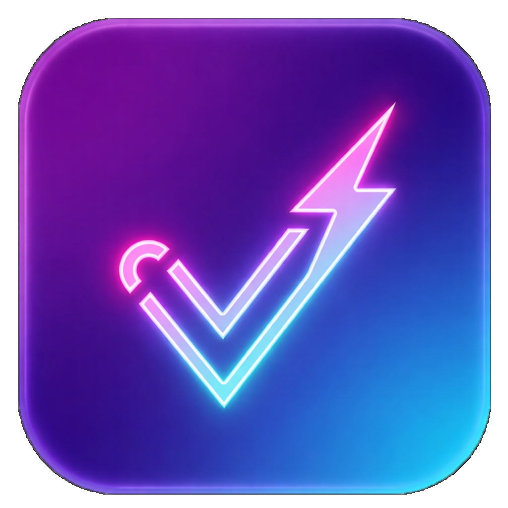

<div align="center">



# CYBER REVIEW

**A plataforma cyberpunk para ranquear qualquer coisa**

[](https://nextjs.org/)
[](https://www.typescriptlang.org/)
[](https://supabase.com/)
[](https://tailwindcss.com/)

</div>

---

## ✨ Sobre o Projeto

**CyberReview** é uma plataforma social gamificada para criar e compartilhar reviews de qualquer coisa — jogos, filmes, carros, músicas e muito mais. Com uma estética cyberpunk única e um sistema de progressão completo, cada review é uma experiência imersiva.

---

## 🚀 Features

| Feature | Descrição |
|---|---|
| 📝 **Reviews** | Crie reviews com atributos customizados, imagens e pontuações |
| 🔀 **Clone** | Clone reviews de outros usuários e adicione seu ponto de vista |
| ❤️ **Likes & Reações** | Curta reviews com emojis e efeitos de partículas customizados |
| 🎁 **Lootboxes** | Ganhe lootboxes ao publicar reviews e desbloqueie itens cosméticos |
| 🏆 **Sistema de XP & Level** | Suba de nível e desbloqueie novos ranks |
| 👾 **Perfil Customizável** | Equipe molduras, banners, efeitos de partículas, títulos e badges |
| 👥 **Amizades** | Adicione amigos e filtre o feed para ver apenas reviews deles |
| 🔍 **Busca Global** | Busque usuários e reviews diretamente na navbar |
| ⚡ **Realtime** | Atualizações ao vivo via Supabase Realtime |

---

## 🎨 Tech Stack

- **Framework:** [Next.js 15](https://nextjs.org/) (App Router)
- **Linguagem:** TypeScript
- **Banco de dados:** [Supabase](https://supabase.com/) (PostgreSQL + Realtime)
- **Autenticação:** Supabase Auth
- **Storage:** Supabase Storage (avatars & imagens)
- **UI:** Vanilla CSS + Tailwind utilitário
- **Fontes:** Orbitron + Inter (Google Fonts)
- **Ícones:** [Lucide React](https://lucide.dev/)

---

## ⚙️ Rodando Localmente

### Pré-requisitos

- Node.js 18+
- Uma conta no [Supabase](https://supabase.com/)

### Instalação

```bash
# 1. Clone o repositório
git clone https://github.com/jeffersongomesdamd/CyberReview.git
cd CyberReview

# 2. Instale as dependências
npm install

# 3. Configure as variáveis de ambiente
cp .env.local.example .env.local
# Preencha com suas credenciais do Supabase

# 4. Rode o servidor de desenvolvimento
npm run dev
```

Acesse [http://localhost:3000](http://localhost:3000)

---

## 🔑 Variáveis de Ambiente

```env
NEXT_PUBLIC_SUPABASE_URL=sua_url_do_supabase
NEXT_PUBLIC_SUPABASE_ANON_KEY=sua_anon_key
```

---

## 📁 Estrutura do Projeto

```
CyberReview/
├── app/                  # App Router (Next.js)
│   ├── FeedClient.tsx    # Feed principal
│   ├── profile/[id]/     # Perfil de usuário
│   └── review/[id]/      # Página da review
├── components/           # Componentes reutilizáveis
│   ├── Navbar.tsx
│   ├── ReviewCard.tsx
│   ├── ReviewModal.tsx
│   ├── ProfileInventory.tsx
│   ├── LootboxOpener.tsx
│   └── ...
├── lib/                  # Utilitários e hooks
│   ├── supabaseClient.ts
│   ├── constants.ts
│   ├── themeUtils.ts
│   └── hooks/
└── public/               # Assets estáticos
```

---

## 📜 Licença

Este projeto é de uso pessoal. Todos os direitos reservados.

---

<div align="center">
  Feito com ⚡ por <a href="https://github.com/jeffersongomesdamd">Jefferson Gomes</a>
</div>
